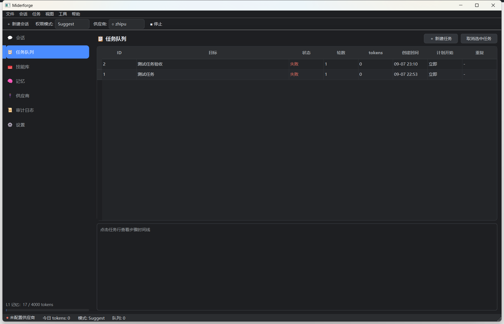
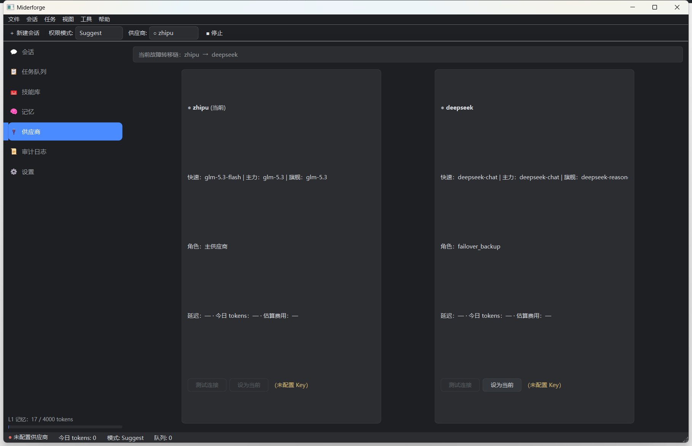
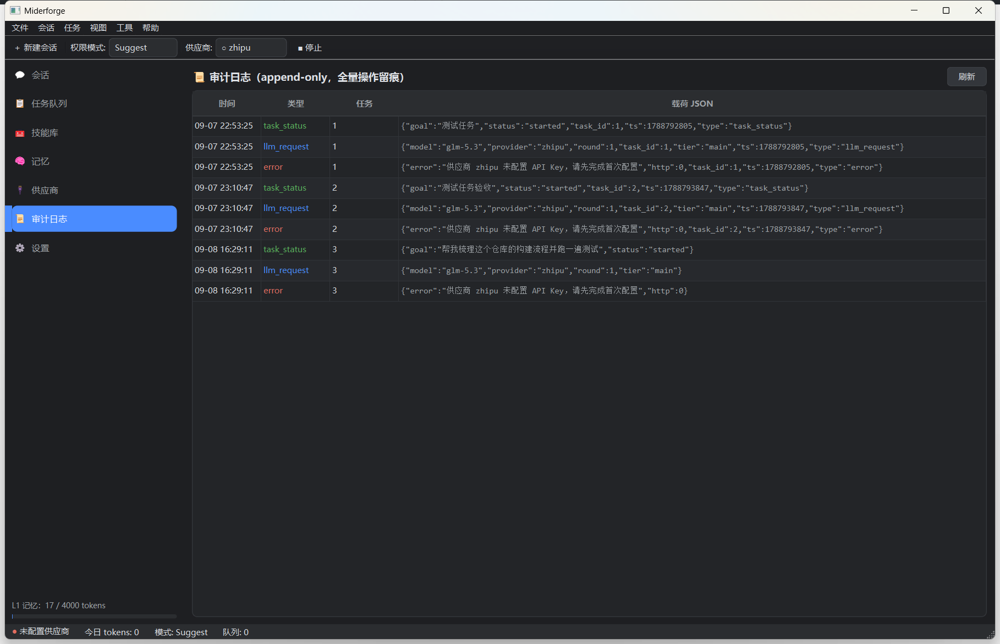

<div align="center">

# 🔨 Miderforge

**云端大脑 · 本地身体 — 运行在你自己电脑上的 AI 编码 Agent**

*A Qt-based Windows desktop AI coding agent: cloud brain (multi-provider LLMs) + local body (a resident C++ process).*

[](LICENSE)
[](https://isocpp.org)
[](https://www.qt.io)
[](https://github.com)
[](#构建)
[](#)
[](https://www.buymeacoffee.com/your-account)

</div>

---

## 📖 简介

Miderforge 是一款可长期驻留的 Windows 桌面 AI Agent 系统。你用中文下达目标，它自主进行多轮 **规划 → 执行 → 观察 → 反思**，操作本机文件与命令直到任务完成——人不在电脑前也行，结束后通过邮件与托盘通知你。

三大核心资产（项目的灵魂）：

| 资产 | 说明 |
|---|---|
| 🧠 **记忆** | L0–L3 分层记忆系统：核心记忆常驻注入、会话摘要滚动、档案库全文检索（FTS5），Agent 越用越懂你 |
| 🧰 **技能库** | 成功任务方案自动固化为可复用 `SKILL.md`（agentskills.io 风格），带使用统计与自动降权 |
| 🗄️ **数据库** | SQLite（WAL + FTS5 trigram）承载记忆/技能/任务/事件的全量持久化与审计 |

## ✨ 功能特性

- 🤖 **自主 Agent 循环** — ReAct 状态机，工具调用、轮数熔断、token 预算、死循环检测三重保险
- 🌊 **流式对话** — 思考过程与正文双栏展示，SSE 分帧解析，断线指数退避自动重试
- 🔀 **多供应商路由** — 智谱 / DeepSeek 直连（无中间商），fast/main/flagship 三档路由，连续失败自动故障转移
- 🔐 **三档权限** — Suggest / Auto Edit / Full Access（Codex 式），永不解禁清单，API Key 由 Windows DPAPI 加密存储
- 🛡️ **Windows 沙箱** — 权限门 + QProcess 环境剥离 + Job Object（超时/内存上限/退出连带终止）
- 📋 **任务队列** — 定时任务、每日重复、执行中目标自动排队，异步完成通知
- 📧 **通知触达** — 任务完成/失败/熔断 → SMTP 邮件（RFC 2047 中文标题）+ 系统托盘气泡
- 🌓 **深色主题 Qt 界面** — 会话视图 / 任务队列 / 技能库 / 记忆 / 供应商 / 审计日志六大面板

## 🏗️ 架构

```
┌─────────────────────────────────────────────────────────────┐
│                     Qt 6 Widgets 深色 UI                     │
│   会话 · 任务队列 · 技能库 · 记忆 · 供应商 · 审计 · 托盘      │
├──────────────┬──────────────────────────────┬───────────────┤
│  core/       │  llm/                        │  tools/       │
│  AgentLoop   │  ChatClient（厂商兼容层）     │  ToolRegistry │
│  Scheduler   │  HttpClient(curl 工作线程)   │  PermissionGate│
│  Router      │  SseParser / SSE 分帧        │  Sandbox      │
├──────────────┴──────────────────────────────┴───────────────┤
│   memory/ 分层记忆        db/ SQLite(WAL+FTS5)               │
│   skills/ 技能自沉淀      notify/ SMTP + 托盘                │
└─────────────────────────────────────────────────────────────┘
```

## ⚠️ 安全须知

**Miderforge 会在你的电脑上读写文件并执行命令。**

- 请从 **Suggest** 权限档开始使用，理解三档权限差异后再提升；
- 敏感路径（`*credential*`、`*.env*`、`id_rsa` 等）任何档位下均被硬拦截；
- 所有操作记录于本地审计日志（`events` 表），可随时回溯；
- 本项目按 MIT 协议“原样”提供，使用者自行承担运行风险。

## 🚀 Quick Start

> **前置条件**：Windows 10+ · Visual Studio 2022/2026 (MSVC) · CMake ≥ 3.24 · vcpkg · Qt 6.8 Widgets

```bat
:: 1. 获取 vcpkg（已有可跳过）
git clone https://github.com/microsoft/vcpkg E:\FILE\APP\vcpkg
E:\FILE\APP\vcpkg\bootstrap-vcpkg.bat -disableMetrics

:: 2. 配置 + 构建（vcpkg manifest 自动安装依赖）
set VCPKG_ROOT=E:\FILE\APP\vcpkg
cmake --preset win64
cmake --build build --config Release --target miderforge mider_tests

:: 3. 运行单元测试（必须全绿）
ctest --preset win64-debug

:: 4. 启动
build\Release\miderforge.exe
```

首次启动会弹出**配置向导**：填入大模型 API Key（[智谱](https://open.bigmodel.cn) / [DeepSeek](https://platform.deepseek.com)），Key 经 Windows DPAPI 加密后本地存储，绝不落明文、绝不上传。

> Qt 路径不同？修改 `CMakePresets.json` 中的 `CMAKE_PREFIX_PATH`。

## 📁 目录结构

```
Miderforge/
├── src/
│   ├── app/        # Qt 界面：主窗口、会话视图、向导、主题
│   ├── core/       # AgentLoop 状态机、任务调度、三档路由
│   ├── llm/        # HttpClient(curl)、SseParser、ChatClient、ProviderManager
│   ├── memory/     # 分层记忆（L1 文件 + L3 库）与 FTS5 检索
│   ├── skills/     # SKILL.md 读写、自沉淀闭环、使用统计
│   ├── tools/      # 工具注册表、文件/命令工具、权限门、沙箱
│   ├── db/         # SQLite 打开/迁移/FTS5 挂载
│   ├── notify/     # SMTP 邮件、托盘通知
│   └── util/       # DPAPI、日志、目录、token 估算
├── tests/          # doctest 单元测试（可脱离 GUI 运行）
├── docs/           # CONFIG.md 配置指南 · ACCEPTANCE.md 验收清单
├── third_party/    # SQLite amalgamation · sqlite-vec（内置源码）
└── config/         # providers.template.json（唯一入库的配置模板）
```

## 🗺️ Roadmap

| 里程碑 | 内容 | 状态 |
|:---:|---|:---:|
| **M0** | 通信管道：SSE 流式 / 双供应商直连 / 工具往返 / 断线重试 | ✅ |
| **M1** | Agent 循环 + 7 工具 + 三档权限 + Windows 沙箱 + 审计日志 | ✅ |
| **M2** | SQLite 四表 + FTS5 分层记忆 + 任务队列 | ✅ |
| **M3** | 技能库 + 自沉淀闭环 | ✅ |
| **M4** | 三档路由 + 故障转移 + 托盘 + 邮件通知 | ✅ |

> 单元测试 53 个（doctest，可脱离 GUI 运行）全部通过。涉及真实 API Key / SMTP 授权码的端到端项请在配置后自行复核，明细见 [docs/ACCEPTANCE.md](docs/ACCEPTANCE.md)。

## 📸 Screenshots

<div align="center">

**💬 会话视图** — 任务气泡 · 流式状态 · 内联错误提示


**📋 任务队列** — 状态语义色 · 步骤时间线



| 🔌 供应商（三档路由 + 故障转移链） | 📜 审计日志（append-only 全量留痕） |
|---|---|
|  |  |

</div>

> 更多视图（🧰 技能库 / 🧠 记忆）见 [docs/assets/screenshots/](docs/assets/screenshots/)。

## 🤝 贡献

欢迎 Issue 与 PR！提交前请：

1. 保持既有代码风格（中文注释、`m_` 成员前缀、命名空间 `miderforge`）；
2. 为纯逻辑改动补充 doctest 单测；
3. 运行密钥自检：`git ls-files | findstr /i "key secret token env pass"`，确认无敏感值；
4. 遵守 [docs/CONFIG.md](docs/CONFIG.md) 开头的密钥卫生红线。

## 💬 联系与反馈

| 渠道 | 链接 |
|---|---|
| 🐛 Bug 反馈 / 功能建议 | [Issues](https://github.com/SiliconCoderJames/miderforge/issues) |
| 💡 讨论交流 | [Discussions](https://github.com/SiliconCoderJames/miderforge/discussions) |
| 📧 邮件（合作/安全漏洞） | 13371891127@139.com |

> 安全漏洞请勿直接公开 Issue，优先通过邮件私下披露，修复后再发布。

## ☕ 赞助支持

如果 Miderforge 帮你省下了时间，欢迎请作者喝杯咖啡 ☕——所有赞助将用于 API 调用测试经费与后续开发。

<a href="https://www.buymeacoffee.com/your-account" target="_blank">
  
</a>

**其他方式：**

| 方式 | 说明 |
|---|---|
| GitHub Sponsors | 仓库右上角 **♥ Sponsor** 按钮（配置见 [.github/FUNDING.yml](.github/FUNDING.yml)） |
| 微信 / 支付宝收钱码 | 占位：将收款二维码图片放入 `docs/assets/` 后在此展示 |

<!--
  发布前替换清单（作者自用，渲染不可见）：
  1. Buy Me a Coffee 账号（两处 buymeacoffee.com/your-account：顶部徽章 + 赞助按钮，
     以及 .github/FUNDING.yml 的 buymeacoffee 条目）
  2. docs/assets/ 放入收款码图片后取消上方表格占位说明
-->

## 📄 License

[MIT](LICENSE) © 2026 Miderforge Contributors
