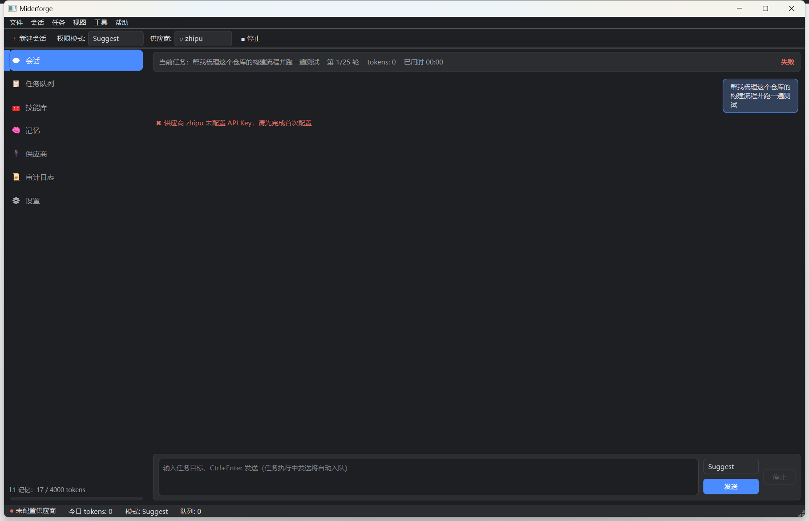

<div align="center">

# 🔨 Miderforge

**会成长的桌面 AI Agent — 记忆 · 技能库 · 类人学习 · 自我成长**

*类 Codex/ZCode 的壳，内部是一套以「记忆分层」为核心加强的 Agent 系统。*

[](LICENSE)
[](https://isocpp.org)
[](https://www.qt.io)
[](https://github.com)
[](#快速开始)

[](https://github.com/SiliconCoderJames/miderforge/actions/workflows/ci.yml)
[](docs/CONFIG.md)
[](https://www.buymeacoffee.com/zwj8jc5rrgp)

</div>

---

## 📖 简介

Miderforge 是一款可长期驻留的 Windows 桌面 AI Agent。你用中文下达目标，它自主进行多轮 **规划 → 执行 → 观察 → 反思**，以受限方式操作本机文件与命令，直到任务完成。

而它真正的差异化在**成长性**：任务结束后自动提炼「结果摘要 → 会话摘要 → 核心记忆改写 → 失败教训」沉淀进分层记忆，并同步失效被新知覆盖的旧记忆；方案成熟的任务自动固化为一项可复用技能。下次遇到同类目标，它会先想起你的偏好、项目背景与上次的坑——**干得越多，越懂你，越熟练**。

> 记忆分层的设计映射计算机存储体系（寄存器 → SRAM → RAM → FLASH → 磁盘），每层有各自的容量、速度与管理策略，详见 [docs/MEMORY-DESIGN.md](docs/MEMORY-DESIGN.md)。

三大核心资产（项目的灵魂）：

| 资产 | 说明 |
|---|---|
| 🧠 **记忆** | L0–L3 分层记忆：核心记忆常驻注入、会话摘要滚动、档案库全文检索（FTS5），带一致性失效与容量纪律 |
| 🧰 **技能库** | 成功任务方案自动固化为可复用 `SKILL.md`（agentskills.io 风格），带使用统计与自动降权 |
| 🗄️ **数据库** | SQLite（WAL + FTS5 trigram）承载记忆/技能/任务/事件的全量持久化与审计 |

## ✨ 功能特性

**🧠 记忆与成长（核心卖点）**

- 🧠 **分层记忆** — L0–L3：核心记忆常驻注入、会话摘要滚动、档案库 FTS5 全文检索，Agent 越用越懂你
- 🔄 **一致性失效** — 任务收尾改写核心记忆时，同步归档被新知覆盖的旧档案（编号白名单校验，防幻觉误伤）
- 🧰 **技能库自沉淀** — 成功任务方案自动固化为 `SKILL.md`，带使用统计与自动降权，渐进披露加载
- 🌱 **类人学习闭环** — 每任务结束由 LLM 提炼摘要/教训/偏好改写入库，下个任务动态检索注入，形成正循环

**🤖 执行与安全**

- 🤖 **自主 Agent 循环** — ReAct 状态机，轮数熔断、增量 token 预算、死循环检测三重保险
- 🔀 **多供应商路由** — 智谱 / DeepSeek 直连，fast/main/flagship 三档路由，故障转移 + 冷却自动回切
- 🔐 **三档权限** — Suggest / Auto Edit / Full Access（Codex 式），永不解禁清单，API Key 由 Windows DPAPI 加密存储
- 🛡️ **Windows 沙箱** — 权限门 + QProcess 环境白名单 + Job Object（超时/内存上限/退出连带终止）
- 📋 **任务队列** — 定时任务、每日重复、执行中目标自动排队，异步完成通知
- 📧 **通知触达** — 任务完成/失败/熔断 → SMTP 邮件（RFC 2047 中文标题）+ 系统托盘气泡
- 🌊 **流式对话** — 思考过程与正文分栏展示，SSE 分帧解析，断线指数退避自动重试

## 📸 界面

<div align="center">
  
  <br><sub>💬 会话视图 — 流式双栏对话 · 任务气泡 · 权限卡片。更多面板截图见 <a href="docs/assets/screenshots/">docs/assets/screenshots/</a></sub>
</div>

## 🚀 快速开始

> **前置条件**：Windows 10+ · Visual Studio 2022/2026 (MSVC) · CMake ≥ 3.24 · vcpkg · Qt 6.8 Widgets

```bat
:: 1. 获取 vcpkg（已有可跳过）
git clone https://github.com/microsoft/vcpkg E:\FILE\APP\vcpkg
E:\FILE\APP\vcpkg\bootstrap-vcpkg.bat -disableMetrics

:: 2. 配置 + 构建（vcpkg manifest 自动安装依赖）
set VCPKG_ROOT=E:\FILE\APP\vcpkg
cmake --preset win64
cmake --build build --config Release --target miderforge mider_tests

:: 3. 运行单元测试（必须全绿）
ctest --preset win64-debug

:: 4. 启动
build\Release\miderforge.exe
```

首次启动会弹出**配置向导**：填入大模型 API Key（[智谱](https://open.bigmodel.cn) / [DeepSeek](https://platform.deepseek.com)），Key 经 Windows DPAPI 加密后本地存储，绝不落明文、绝不上传。

> Qt 路径不同？修改 `CMakePresets.json` 中的 `CMAKE_PREFIX_PATH`。

## 📚 文档

| 文档 | 说明 |
|---|---|
| 🧠 [docs/MEMORY-DESIGN.md](docs/MEMORY-DESIGN.md) | 记忆分层设计：存储体系类比、每层管理策略、一致性失效机制 |
| 📖 [docs/CONFIG.md](docs/CONFIG.md) | 详细配置指南：供应商 Key、权限档、SMTP 通知与密钥卫生红线 |
| ✅ [docs/ACCEPTANCE.md](docs/ACCEPTANCE.md) | 逐条验收清单、审查处置结论与设计取舍 |
| 🤝 [CONTRIBUTING.md](CONTRIBUTING.md) | 贡献指南：开发环境、代码风格、测试与提交要求 |
| 🔒 [SECURITY.md](SECURITY.md) | 安全策略：漏洞报告流程、安全设计要点 |

## 🏗️ 架构

```
┌─────────────────────────────────────────────────────────────┐
│                     Qt 6 Widgets 深色 UI                     │
│   会话 · 任务队列 · 技能库 · 记忆 · 供应商 · 审计 · 托盘      │
├──────────────┬──────────────────────────────┬───────────────┤
│  core/       │  llm/                        │  tools/       │
│  AgentLoop   │  ChatClient（厂商兼容层）     │  ToolRegistry │
│  Scheduler   │  HttpClient(curl 工作线程)   │  PermissionGate│
│  Router      │  SseParser / SSE 分帧        │  Sandbox      │
├──────────────┴──────────────────────────────┴───────────────┤
│   memory/ 分层记忆        db/ SQLite(WAL+FTS5)               │
│   skills/ 技能自沉淀      notify/ SMTP + 托盘                │
└─────────────────────────────────────────────────────────────┘
```

构建分两层静态库：`mider_core`（QtCore 级，无 UI 依赖，单测只链接它）+ `mider_ui`（Widgets 层）。

## 📁 目录结构

```
Miderforge/
├── src/
│   ├── app/        # Qt 界面：主窗口、会话视图、向导、主题
│   ├── core/       # AgentLoop 状态机、任务调度、三档路由
│   ├── llm/        # HttpClient(curl)、SseParser、ChatClient、ProviderManager
│   ├── memory/     # 分层记忆（L1 文件 + L3 库）与 FTS5 检索
│   ├── skills/     # SKILL.md 读写、自沉淀闭环、使用统计
│   ├── tools/      # 工具注册表、文件/命令工具、权限门、沙箱
│   ├── db/         # SQLite 打开/迁移/FTS5 挂载
│   ├── notify/     # SMTP 邮件、托盘通知
│   └── util/       # DPAPI、日志、目录、token 估算、JSON 提取
├── tests/          # doctest 单元测试（只依赖核心库，可脱离 GUI 运行）
├── docs/           # CONFIG.md · ACCEPTANCE.md · MEMORY-DESIGN.md · 界面截图
├── third_party/    # SQLite amalgamation · sqlite-vec（内置源码）
└── config/         # providers.template.json（唯一入库的配置模板）
```

## 🗺️ Roadmap

| 里程碑 | 内容 | 状态 |
|:---:|---|:---:|
| **M0** | 通信管道：SSE 流式 / 双供应商直连 / 工具往返 / 断线重试 | ✅ |
| **M1** | Agent 循环 + 7 工具 + 三档权限 + Windows 沙箱 + 审计日志 | ✅ |
| **M2** | SQLite 四表 + FTS5 分层记忆 + 任务队列 | ✅ |
| **M3** | 技能库 + 自沉淀闭环 | ✅ |
| **M4** | 三档路由 + 故障转移 + 托盘 + 邮件通知 | ✅ |
| **M4.5** | 记忆分层强化：一致性失效 / L1 容量纪律 / 增量 token 记账 | ✅ |
| **M5** | 中断分级：四级中断模型（系统/熔断/用户/操作级）、暂停恢复、取消令牌传导、checkpoint 续跑 | ✅ |

> 单元测试 78 个用例（doctest，只依赖 mider_core、可完全脱离 GUI 运行）全部通过。涉及真实 API Key / SMTP 授权码的端到端项请在配置后自行复核，明细见 [docs/ACCEPTANCE.md](docs/ACCEPTANCE.md)。

## 🤝 贡献

欢迎 Issue 与 PR！提交前请阅读 [CONTRIBUTING.md](CONTRIBUTING.md)，要点：

1. 保持既有代码风格（中文注释、`m_` 成员前缀、命名空间 `miderforge`）；
2. 为纯逻辑改动补充 doctest 单测，并保持全绿；
3. 通过密钥自检：`git ls-files | findstr /i "key secret token env pass"`，确认无敏感值入库。

## 🔒 安全

**Miderforge 会在你的电脑上读写文件并执行命令。** 请从 **Suggest** 权限档开始使用；敏感路径任何档位下均被硬拦截；所有操作记录于本地审计日志。安全漏洞请**勿**公开 Issue，优先通过邮件私下披露——完整流程见 [SECURITY.md](SECURITY.md)。

## 📬 社区与反馈

| 渠道 | 链接 |
|---|---|
| 🐛 Bug 反馈 / 功能建议 | [Issues](https://github.com/SiliconCoderJames/miderforge/issues) |
| 💡 讨论交流 | [Discussions](https://github.com/SiliconCoderJames/miderforge/discussions) |
| 📧 邮件（合作/安全漏洞） | 13371891127@139.com |

## ☕ 赞助支持

如果 Miderforge 帮你省下了时间，欢迎请作者喝杯咖啡 ☕——所有赞助将用于 API 调用测试经费与后续开发。

<div align="center">
  <a href="https://www.buymeacoffee.com/zwj8jc5rrgp" target="_blank">
    
  </a>
  <br><br>
  
  <br><sub>扫码直达赞助页 · Scan to buy me a coffee</sub>
</div>

**其他方式：**

- **GitHub Sponsors** — 仓库首页右上角 **♥ Sponsor** 按钮（[.github/FUNDING.yml](.github/FUNDING.yml) 已配置）
- **微信 / 支付宝收款码** — 暂未开放，开放后会在此补充

## 📄 License

[MIT](LICENSE) © 2026 Miderforge Contributors
